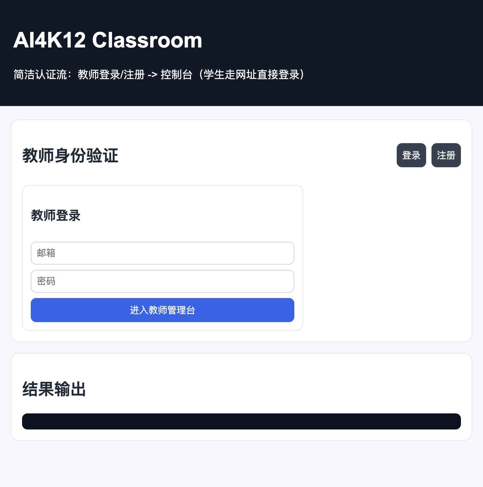
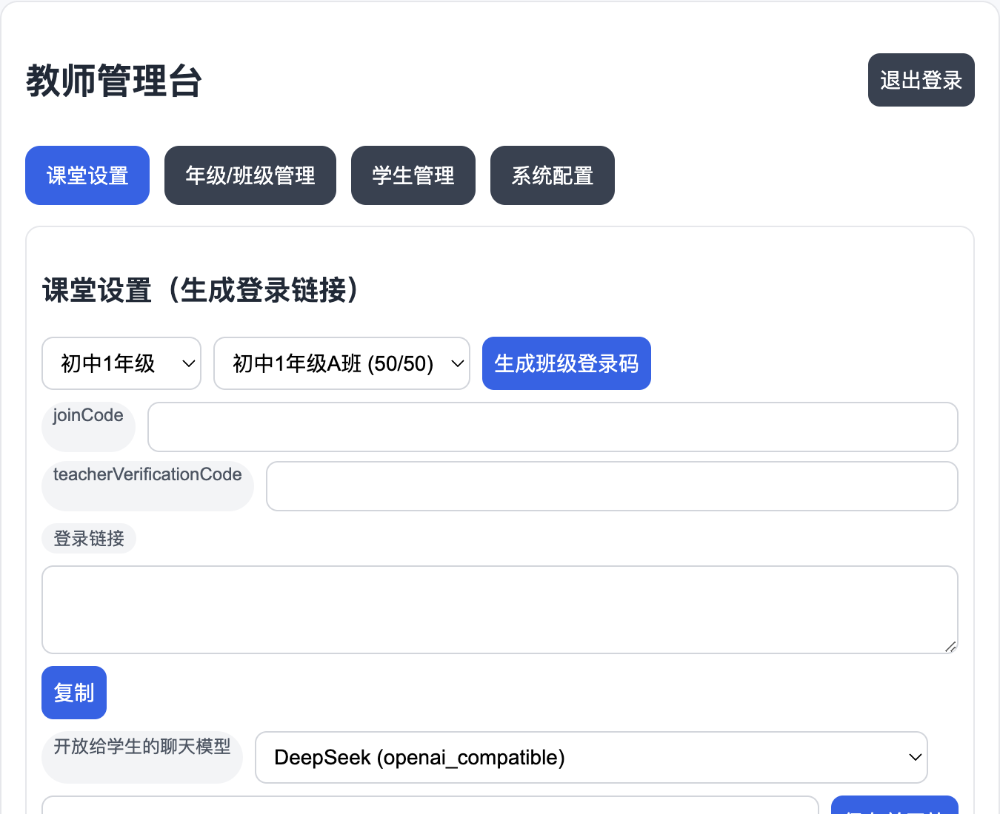
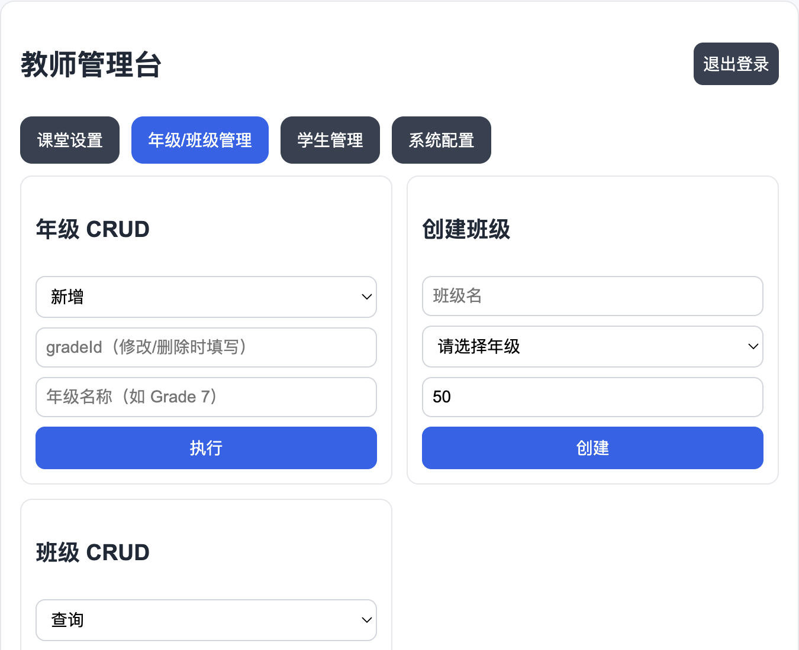
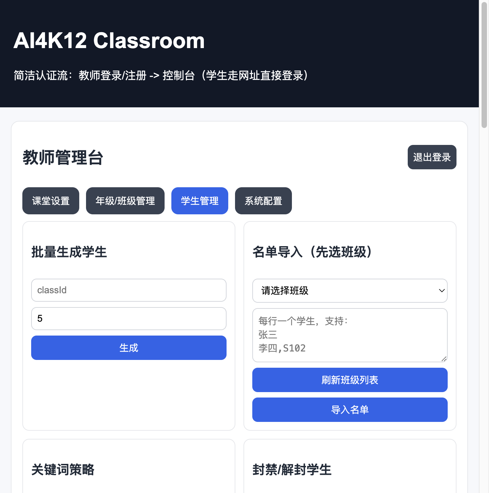
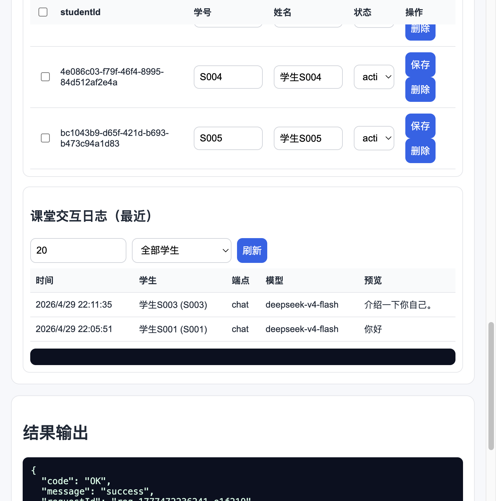
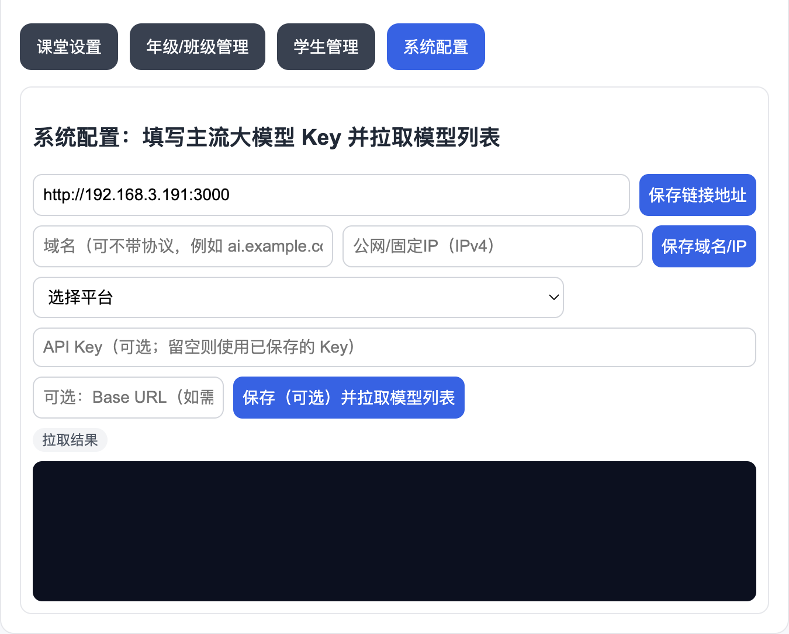
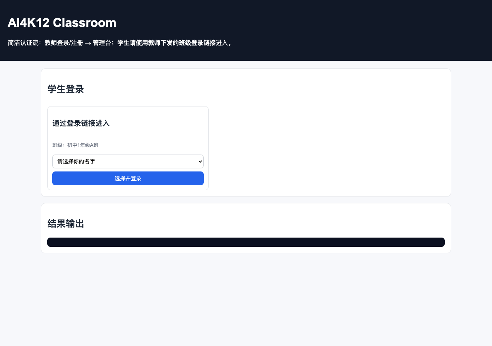
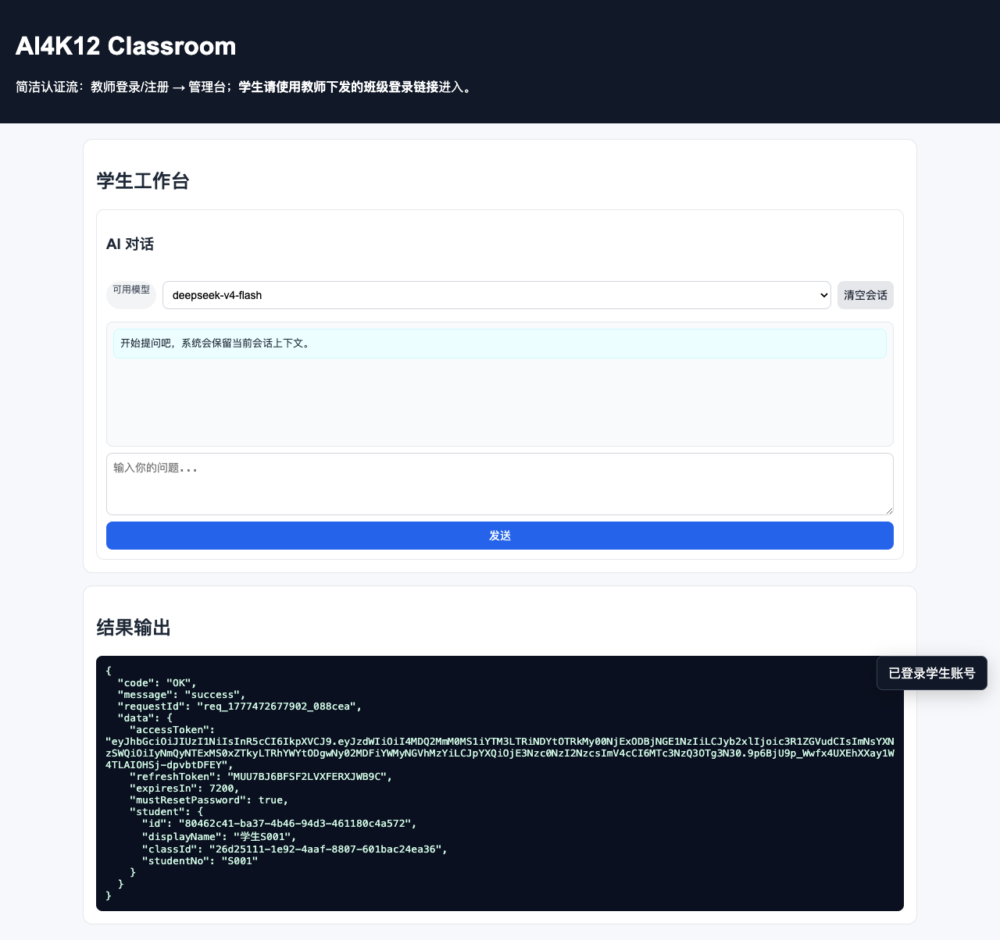

# AI4K12 - K12 AI 课堂平台 MVP

> 面向开源项目主页展示的版本请见：`README.open-source.md`

面向中小学课堂场景的 AI 教学平台示例项目。  
后端基于 Node.js + Express，提供教师端班级管理、学生接入、课堂模型策略、限额与风控、AI 能力网关（文本/图片/绘本/视频）等能力；前端提供一个可直接演示全流程的单页控制台。

> 当前定位是 **MVP/演示工程**：业务数据仍以内存存储为主；系统配置（`publicBaseUrl`）与 Provider Key 已支持 SQLite 本地持久化。

---

## 1. 项目目标与定位

本项目围绕 `K12_AI_Classroom_Product_Requirement_CN.md` 的核心目标落地：

- 教师注册登录后创建班级，默认支持 50 席位
- 学生通过 **教师下发的登录链接**（或后端 `login-by-code` 接口）快速接入，不依赖手机号
- 教师可控制学生可用模型、关键词策略、子账号限额和封禁
- 提供课堂 AI 能力入口并记录可审计的使用日志
- 支持趣味功能扩展（绘本/视频异步任务形态）

---

## 2. 核心能力总览

### 教师端

- 教师注册、登录、锁定保护（连续失败登录限制）
- 年级 CRUD、班级 CRUD（含分页/搜索）
- 学生管理：
  - 单个新增/修改/删除
  - 批量生成账号
  - 名单导入
  - 封禁/解封
  - 每学生独立限额（请求、Token、图片、视频、绘本）
- 班级码与教师验证码轮换
- 班级模型策略配置（开放哪些 chat/image 模型）
- 系统 Provider 管理：
  - 保存 API Key / Base URL
  - 拉取 Provider 模型列表
- 课堂使用日志查看（请求/响应详情、模型、成本）
- 实时看板接口（在线人数、配额用量、告警）

### 学生端

- **使用教师生成的班级登录链接**（`joinCode + teacherVerificationCode`）：打开链接后在名单中选择本人姓名登录
- 后端仍提供 `classId + studentNo + loginCode` 接口（`POST /student/login-by-code`），供集成与测试；演示前端不再提供手填入口
- 首次改密（可选）
- AI 文本对话（演示前端主推能力）

### 安全与治理

- JWT 鉴权 + 角色校验（teacher / student）
- 错误次数锁定机制
- 班级关键词黑名单/白名单策略
- 学生封禁状态校验
- 班级/学生双层配额控制
- 统一响应结构与错误码

---

## 3. 技术栈

- **Runtime**: Node.js (ESM)
- **Backend**: Express 5
- **Validation**: Zod
- **Auth**: JSON Web Token (`jsonwebtoken`)
- **Password Hashing**: `bcryptjs`
- **ID**: UUID / `crypto.randomUUID`
- **Testing**: Vitest + Supertest + V8 Coverage
- **Frontend**: 原生 HTML/CSS/JS（`web/`）

---

## 4. 目录结构

```text
AI4K12/
├── src/
│   ├── app.js          # 主应用，所有 API 路由
│   ├── server.js       # 启动入口
│   ├── auth.js         # JWT 与统一响应封装
│   ├── config.js       # 运行配置
│   ├── providers.js    # Provider 目录、模型拉取、Key 管理
│   └── store.js        # 内存数据库与用量聚合方法
├── docs/
│   └── screenshots/  # README 界面截图（可 npm run screenshots 局部重导）
├── scripts/
│   └── capture-ui-screenshots.mjs
├── web/
│   ├── index.html      # 教师/学生演示控制台
│   ├── app.js          # 前端交互逻辑
│   └── styles.css
├── test/
│   ├── app.test.js
│   └── coverage-branches.test.js
├── K12_AI_Classroom_Product_Requirement_CN.md
├── vitest.config.js
└── package.json
```

---

## 5. 快速启动

### 5.1 安装依赖

```bash
npm install
```

### 5.2 启动服务

```bash
npm run dev
```

默认监听 `http://localhost:3000`，并静态托管 `web/` 前端页面。

### 5.3 健康检查

```bash
curl http://localhost:3000/health
```

### 5.4 界面截图（演示）

下图使用默认教师账号 `admin@laoshibao.com` / `admin@laoshibao.com` 在本地启动后采集；**学生端仅通过教师下发的登录链接**（页面 URL 携带 `joinCode` 与 `teacherVerificationCode`）进入。PNG 源文件放在 `docs/screenshots/`。

**教师端**



教师登录页：邮箱与密码登录后进入管理台（会话会写入浏览器本地存储，刷新可保持登录）。



**课堂设置**：选择年级/班级，生成/复制 joinCode、教师验证码与登录链接，并配置对学生开放的聊天模型。



**年级/班级管理**：年级与班级的创建、查询、修改、删除及分页检索。



**学生管理**：批量生成、名单导入、关键词与封禁策略、学生 CRUD；上方为常用工具区，向下滚动可见学生表与课堂日志。



**课堂交互日志**（与学生表同属「学生管理」标签页下方）：按时间查看学生调用记录与模型等摘要。



**系统配置**：学生登录链接 Base URL、域名/IP，以及各模型平台的 API Key 与拉取模型列表。

**学生端**



**登录链接**：由教师在「课堂设置」生成；学生在浏览器中打开该链接，在班级名单中点选自己的姓名并登录（无需输入 classId / 登录码）。



**学生工作台**：选择允许使用的模型后与 AI 对话（支持清空会话与多轮上下文）。

**重新生成截图（可选）**

另开终端启动 `npm run dev` 后执行：

```bash
npx playwright install chromium   # 首次需要
npm run screenshots
```

可通过环境变量覆盖默认值：`AI4K12_BASE_URL`、`AI4K12_JOIN_CODE`、`AI4K12_TEACHER_VERIFICATION_CODE`（须与当前运行实例中该班级的码一致）。

---

## 6. 默认演示数据

服务启动时（`NODE_ENV !== test`）会自动初始化演示数据：

- 默认教师账号：
  - `email`: `admin@laoshibao.com`
  - `password`: `admin@laoshibao.com`
- 自动生成 12 个年级与对应 A 班
- 自动为 `初中1年级A班` 生成 50 个学生（用于教师登录链接中的「选择姓名」名单演示）

另外提供开发用重置接口：

- `POST /api/v1/dev/seed-k12`（仅默认教师可调用）

> 提示：该默认账号仅用于本地演示，生产环境务必移除并改为安全初始化流程。

---

## 7. 环境变量

| 变量名 | 默认值 | 说明 |
| --- | --- | --- |
| `PORT` | `3000` | 服务端口 |
| `HOST` | `0.0.0.0` | 服务绑定地址 |
| `PUBLIC_BASE_URL` | 自动检测局域网IP | 默认学生登录链接地址 |
| `PUBLIC_DOMAIN` | - | 对外访问域名（未带协议时默认按 HTTPS 处理） |
| `PUBLIC_IP` | - | 对外访问 IP（IPv4） |
| `CONFIG_DB_PATH` | `data/ai4k12.db` | 系统配置持久化 SQLite 路径 |
| `JWT_SECRET` | `dev-secret-change-in-prod` | JWT 签名密钥（生产必须替换） |
| `NODE_ENV` | - | `test` 时会禁用自动 seed |

---

## 8. API 总览（`/api/v1`）

### 8.1 系统与 Provider

- `GET /system/providers`
- `PUT /system/providers/:providerKey/keys`
- `GET /system/providers/:providerKey/models`

### 8.2 教师与班级

- `POST /teacher/register`
- `POST /teacher/login`
- `POST /grades`
- `GET /grades`
- `PUT /grades/:gradeId`
- `DELETE /grades/:gradeId`
- `POST /classes`
- `GET /classes`
- `GET /classes/:classId`
- `PUT /classes/:classId`
- `DELETE /classes/:classId`

### 8.3 学生管理（教师操作）

- `POST /classes/:classId/students/batch-generate`
- `POST /classes/:classId/students/import`
- `GET /classes/:classId/students`
- `POST /classes/:classId/students`
- `PUT /classes/:classId/students/:studentId`
- `DELETE /classes/:classId/students/:studentId`
- `PUT /classes/:classId/students/:studentId/limits`
- `POST /classes/:classId/students/:studentId/ban`
- `POST /classes/:classId/students/:studentId/unban`

### 8.4 课堂策略与监控

- `POST /classes/:classId/codes/rotate`
- `GET /classes/:classId/policies/ai-models`
- `PUT /classes/:classId/policies/ai-models`
- `PUT /classes/:classId/policies/keywords`
- `GET /classes/:classId/usage`
- `GET /classes/:classId/dashboard/realtime`

### 8.5 学生接入与登录

- `POST /student/join-by-class-code`
- `POST /student/login-by-code`
- `POST /student/reset-password`
- `GET /public/join/students`
- `POST /public/join/login`

### 8.6 AI 能力

- `GET /ai/models`
- `POST /ai/chat/completions`
- `POST /ai/images/generations`
- `GET /ai/fun/providers`
- `POST /ai/storybooks/generations`
- `POST /ai/videos/generations`

---

## 9. 支持的 Provider（模型目录与 Key 管理）

当前内置 Provider Catalog：

- `siliconflow`
- `zai`（智谱 BigModel）
- `moonshot`
- `deepseek`
- `volcengine`
- `dashscope`（静态模型列表）

调用链路：

1. 教师通过系统接口保存 Provider Key  
2. 可按 Provider 拉取模型列表  
3. 在班级策略中设置允许模型  
4. 学生侧只看到班级允许的模型  
5. 聊天请求优先走班级策略与已配置 Provider

---

## 10. 测试与覆盖率

### 10.1 运行测试

```bash
npm test
```

### 10.2 运行覆盖率

```bash
npm run test:coverage
```

覆盖率配置（`vitest.config.js`）：

- 覆盖范围：`src/**/*.js`（排除 `src/server.js`）
- 阈值要求：lines/functions/branches/statements 全部 `>= 85%`

测试内容覆盖了：

- 主业务闭环（教师->班级->学生->AI）
- 认证缺失/无效/越权分支
- 登录锁定、码过期、容量上限、白黑名单
- 学生限额、封禁、模型策略、使用日志
- 大量错误分支与边界参数

---

## 11. 与需求文档对照

需求文档：`K12_AI_Classroom_Product_Requirement_CN.md`

### 已落地（代码中可用）

- 教师注册登录与班级管理
- 学生批量生成/导入/CRUD
- 班级码与验证码机制
- 学生接入双路径（登录码 + join link）
- 文本/图片 AI 接口
- 子账号限额、关键词策略、封禁
- 课堂用量日志与实时看板接口
- 趣味功能接口（绘本/视频/provider 列表）

### 当前仍属 MVP 简化实现

- 数据层为内存存储（非 PostgreSQL/Redis）
- 没有持久化会话、审计归档、学校管理员完整后台
- AI 任务执行以 mock/简化流程为主（尤其图片/绘本/视频）
- 缺少生产级限流中间件、异步队列、告警系统

---

## 12. 生产化演进建议

按优先级建议：

1. 将 `store.js` 内存数据迁移到 PostgreSQL + Redis
2. 补齐 refresh token 持久化与会话吊销机制
3. 引入队列系统（如 BullMQ）处理图片/视频/绘本异步任务
4. 增加结构化审计日志、风控策略中心、告警通道
5. 完善多租户（学校）与计费配额体系
6. 为 API 增加 OpenAPI 文档与契约测试

---

## 13. 常用脚本

- `npm run dev`：启动服务（开发）
- `npm start`：启动服务（生产模式命令别名）
- `npm test`：运行测试
- `npm run test:coverage`：运行测试并生成覆盖率报告
- `npm run test:watch`：watch 模式测试
- `npm run screenshots`：在本地服务已启动时，用 Playwright 重导 `docs/screenshots/` 中学生端相关截图（见 **5.4**）

---

## 14. 免责声明

本仓库为教学/产品验证性质示例。默认账号、默认密钥、内存存储等实现不满足生产安全要求。请在生产部署前完成安全加固、密钥治理、持久化与合规审查。

